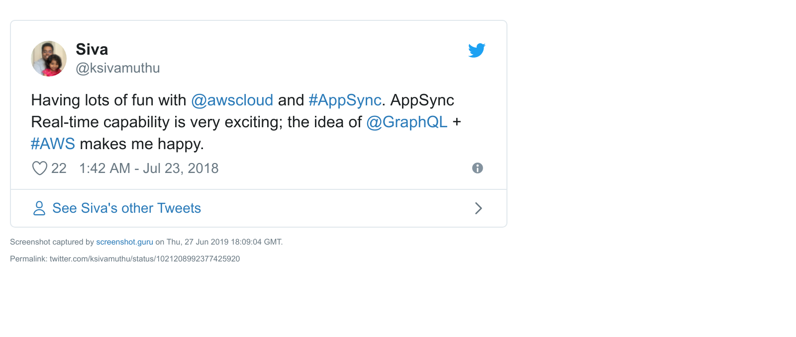

# AWS AppSync Conference Sample

This sample reference application shows how to use GraphQL to build an application that a user can login to the system, see the confernece, sessions and speaker details. The sample is written in React and uses AWS AppSync, Amazon Cognito, Amazon DynamoDB, Amazon PinPoint and Amazon S3 as well as the Amplify CLI.

---
This tweet is my reaction when I started exploring AWS AppSync. I'm impressed on how AWS Amplify & Appsync evolved over an year. Integration with backend and client libraries are awesome.

<a href="https://twitter.com/ksivamuthu/status/1021208992377425920" ></a>

## Slides

Slides are here - https://slides.com/sivamuthukumar/building-serverless-graphql-using-aws-amplify/fullscreen

## Topics

* [AWS AppSync](https://aws.amazon.com/appsync/)
* [AWS Amplify CLI](https://aws-amplify.github.io)
* [AWS Amplify Client Libraries](https://aws-amplify.github.io/docs/js/start?ref=amplify-js-btn&platform=purejs)
* [AWS Amplify GraphQL Transforms](https://aws-amplify.github.io/docs/cli/graphql?sdk=js)

## Demo Features

- [x] Authentication
- [ ] Authorization
- [x] GraphQL Query
- [x] GraphQL Mutation
- [x] GraphQL Subscription
- [x] Elastic Search 
- [ ] Search Functionality in Client
- [x] Lambda Functions Resources
- [x] DynamoDB Resource
- [ ] Chatbot


## Prerequisites

+ [AWS Account](https://aws.amazon.com/mobile/details/)

+ [NodeJS](https://nodejs.org/en/download/) with [NPM](https://docs.npmjs.com/getting-started/installing-node)

+ [AWS Ampify CLI](https://aws-amplify.github.io/)
  - `npm install -g @aws-amplify/cli`
  - `amplify configure` 

## Getting Started

1. Clone this repo locally.

```
git clone https://github.com/ksivamuthu/aws-amplify-conference.git
cd aws-amplify-conference
```

2. Initialize the amplify project.

```
amplify init
```

3. Configure an Amazon Cognito User Pool to manage user credentials.

```
amplify add auth
```

4. Configure an Amazon S3 bucket to store files.

```
amplify add storage
```

5. Configure an Amazon Pinpoint to track events

```
amplify add analytics
```

6. Configure an AWS AppSync API to interact with your backend data sources such as Amazon DynamoDB, Amazon Elasticsearch, AWS Lambda.

```
amplify add api

# When prompted for a schema.graphql provide the value "schema.graphql"
# to point to the file checked in to the root of the project directory.
```

Read about [GraphQL Transforms](https://aws-amplify.github.io/docs/cli/graphql) on @model, @searchable, @function directives

```
type Conference @model {
  id: ID!
  title: String!
  year: Int!
  websiteUrl: String!
  location: String!
  contact: String!
  sessions: [Session]! @connection(name: "ConferenceSessions")
}

type Session @model @searchable {
  id: ID!
  title: String!
  abstract: String!
  level: Level!
  category: Category!
  keywords: [String]!
  favorites: [UserSessionVote]! @connection(name: "UserSessionVotes")
  conference: Conference! @connection(name: "ConferenceSessions")
  speaker: Speaker! @connection(name: "SessionSpeakers")
}

type Speaker @model {
  id: ID!
  name: String!
  bio: String!
  facts: String @function(name: "speakerfacts-${env}")
  jobtitle: String!
  phonenumber: String!
  companyname: String!
  companywebsite: String!
  blog: String!
  website: String!
  twitter: String!
  facebook: String!
  linkedin: String!
  sessions: [Session]! @connection(name: "SessionSpeakers")
}

type UserSessionVote @model {
  id: ID!
  userId: String!
  session: Session! @connection(name: "UserSessionVotes")
}

enum Level {
  BEGINNER
  INTERMEDIATE
  ADVANCED
}

enum Category {
  GeneralDiscussion
  ClientDevelopment
  WebDevelopment
  DatabaseDevelopment
  CloudDevelopment
  Design
  ProfessionalDevelopment
  CareerAdvancement
  ITTopics
}
```

7. Deploy your project.

```
amplify push

# When asked if you would like to generate client code, you can
# say no since we are using plain JavaScript.
```

8. Install client dependencies.

```
npm install

# or
yarn
```

9. Run the react application

```
npm run start

# or
yarn start
```

The sample uses [AWS Amplify](https://github.com/aws/aws-amplify) to perform the Sign-Up and Sign-In flows with a Higher Order Component and its GraphQL calls.

## Contributing

Contributions are what make the open source community such an amazing place to be learn, inspire, and create. Any contributions you make are greatly appreciated.

* Fork the Project
* Create your Feature Branch (git checkout -b feature/AmazingFeature)
* Commit your Changes (git commit -m 'Add some AmazingFeature)
* Push to the Branch (git push origin feature/AmazingFeature)
* Open a Pull Request
  
## License

Distributed under the MIT License. See LICENSE for more information.
